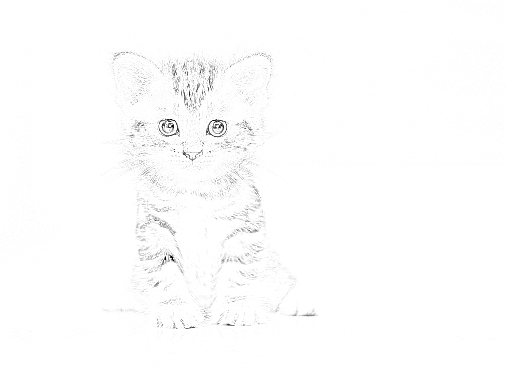

# ImageToPencilSketch🖼📝
This my first mini-project about creating **pencil sketch** of image✍️🎨
## CV2 library
In this project I have used cv2 library to work with images.
To install this library write
```
pip install cv2
```
After installing the library, clone this [git-repository](https://github.com/RahimHakimov/ImageToPencilSketch) with command below:
```
git clone https://github.com/RahimHakimov/ImageToPencilSketch
```
After cloning the repository and installing cv2 library, now you are ready to create **pencil sketch** from the image.
Run the `main.py` with command below:
```
python main.py
```
After running you will see:
```
Image name:
``` 
You must write the name of image with his path, and put the `Enter`-button
For example,
```
Image name: cat.jpg
``` 
You will get the new file, named `pencil_sketch_cat.jpg`.
### Result
##### Example 1
_Image before:_

_Image after:_


##### Example 2
_Image before:_

_Image after:_


## Thanks for attention!
